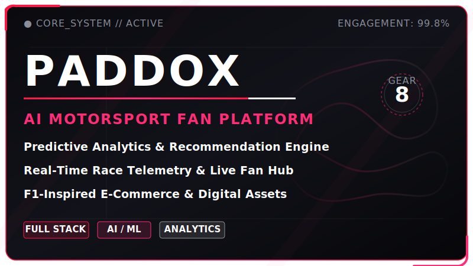
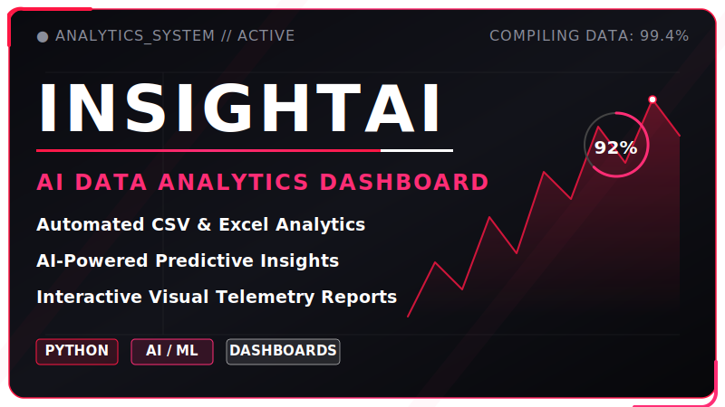
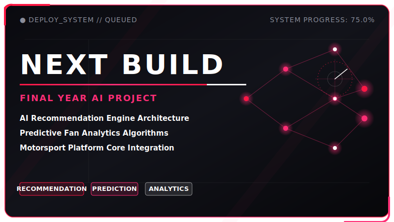
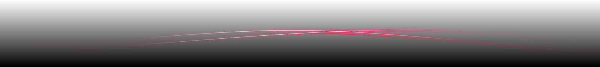

  

<h1 align="center">Hi, I'm Jenivaa M 👋</h1>

<strong>AI Student • Full Stack Developer • Motorsport Tech Builder</strong>

  

  

  

## 🏁 ABOUT ME

* 🎓 CSE Artificial Intelligence student passionate about real-world tech projects
* 💻 Interested in full-stack development, AI/ML, data analytics, and premium UI/UX
* 🏎️ Currently building **PADDOX**, a motorsport-inspired fan engagement platform with AI-powered personalization

---

## 🧭 CURRENT FOCUS

| Track | What I'm Building |
| :--- | :--- |
| **AI/ML** | Recommendation systems, prediction models, and analytics |
| **Full Stack** | Real-world web apps with frontend, backend, database, and APIs |
| **Data Analytics** | Dashboards, insights, CSV/Excel analysis, and visual reports |
| **Motorsport Tech** | PADDOX and racing-inspired digital systems |
| **UI/UX** | Premium dark interfaces, animations, and interactive experiences |

  

## 🛠️ TECH STACK

  

---

## ⚡ FEATURED PROJECT

### PADDOX — AI-Based Personalized Recommendation and Predictive Analytics System for Digital Fan Engagement

PADDOX is a premium motorsport fan platform that brings together race updates, driver statistics, fan engagement, ecommerce, digital assets, admin controls, and AI-based personalization into one interactive ecosystem.

  

| Module | Features |
| :--- | :--- |
| **Race Intelligence** | Calendar, circuit info, live motorsport APIs |
| **Fan Hub** | Polls, quotes, leaderboard, trivia, wallpapers |
| **Shop** | Cart, wishlist, coupons, checkout, receipts |
| **Admin** | Products, orders, users, coupons, polls, wallpapers |
| **AI Layer** | Recommendations, prediction, fan analytics |

   
  
  &nbsp;&nbsp;
  

  

## 📁 PROJECTS

  
  
  

| Project | Description | Tech Stack |
| :--- | :--- | :--- |
| **PADDOX Frontend** | Premium motorsport fan platform frontend | HTML, CSS, JavaScript |
| **PADDOX Backend** | Backend API for authentication, products, orders, users, admin, and digital assets | Node.js, Express, MongoDB |
| **InsightAI Analytics Dashboard** | AI-powered CSV and Excel analytics dashboard | Python, AI/ML |
| **More Projects Coming Soon** | Portfolio and final-year project updates | AI, Web, Data |

---

## 📊 GITHUB PERFORMANCE

  
  &nbsp;&nbsp;
  

  

  

## 🤝 CONNECT WITH ME

<!-- Replace yourmail@example.com and your-linkedin with your real contact details -->

  
  &nbsp;&nbsp;
  
  &nbsp;&nbsp;
  

---

  <em>Built with speed, precision, AI, and motorsport energy 🏎️</em>

  

<!-- 
How to Use This Profile README:
1. Create a public GitHub repository named exactly "Jenivaa-07"
2. Add this README.md file
3. Place your existing banner GIF at assets/f1-race-streak-banner.gif
4. Place the generated SVG assets (divider-race-line.svg, paddox-card.svg, insightai-card.svg, comingsoon-card.svg, f1-race-streak-footer.svg) inside the assets folder
5. Commit and push the changes
-->
