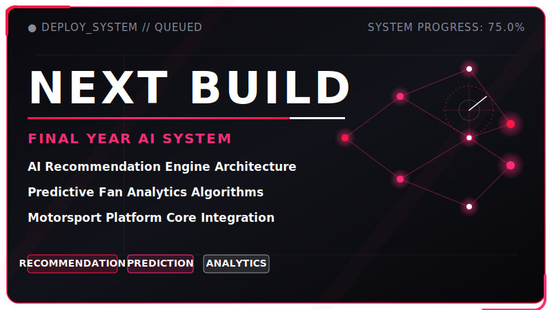

<p align="center">
  
</p>

<p align="center">
  
</p>

<p align="center">
  <a href="https://github.com/Jenivaa-07">
    
  </a>
  &nbsp;&nbsp;
  <a href="https://github.com/Jenivaa-07/paddox-frontend">
    
  </a>
  &nbsp;&nbsp;
  <a href="https://github.com/Jenivaa-07/paddox-backend">
    
  </a>
  &nbsp;&nbsp;
  <a href="https://www.linkedin.com/in/your-linkedin">
    
  </a>
</p>

<p align="center">
  
</p>

## > paddock://whoami

```text
ROLE      CSE Artificial Intelligence Student
FOCUS     Full Stack • AI/ML • Data Analytics • UI/UX
BUILDING  PADDOX — Motorsport Fan Platform
MISSION   Building real-world products with speed and intelligence
```

---

## > telemetry/focus.yml

| Track | Current Build Mode |
| :--- | :--- |
| **AI/ML** | Recommendation systems, prediction models, and analytics |
| **Full Stack** | Frontend, backend, database, authentication, and APIs |
| **Data Analytics** | Dashboards, CSV/Excel insights, and visual reports |
| **Motorsport Tech** | PADDOX, race data, fan engagement, and circuit systems |
| **UI/UX** | Premium dark interfaces, animations, and interactive layouts |
| **Final Year Project** | AI-based personalized recommendation and predictive analytics system |

<p align="center">
  
</p>

## > garage/projects

<p align="center">
  
  <br /><br />
  
  <br /><br />
  
</p>

| Project | Description | Tech Stack |
| :--- | :--- | :--- |
| **PADDOX Frontend** | Premium motorsport fan platform frontend | HTML, CSS, JavaScript |
| **PADDOX Backend** | Backend API for auth, products, orders, admin, and digital assets | Node.js, Express, MongoDB |
| **InsightAI Analytics Dashboard** | AI-powered data analytics dashboard | Python, AI/ML |
| **Final Year AI System** | Recommendation and predictive analytics project | AI, ML, Data |

---

## > featured/paddox

### PADDOX — AI-Based Personalized Recommendation and Predictive Analytics System for Digital Fan Engagement

**PADDOX is my main motorsport-tech platform and final-year project foundation.**

PADDOX is a premium motorsport fan platform combining race updates, ecommerce, interactive fan hubs, and AI-powered personalization into a unified ecosystem.

| Module | Features |
| :--- | :--- |
| **Race Intelligence** | Calendar, circuit information, race data APIs |
| **Fan Hub** | Polls, quotes, leaderboard, trivia, wallpapers |
| **Shop** | Cart, wishlist, coupons, checkout, receipts |
| **Admin** | Products, orders, users, coupons, polls, wallpapers |
| **AI Layer** | Recommendations, prediction, fan analytics |

<p align="center">
  <br />
  <a href="https://github.com/Jenivaa-07/paddox-frontend">
    
  </a>
  &nbsp;&nbsp;
  <a href="https://github.com/Jenivaa-07/paddox-backend">
    
  </a>
</p>

<p align="center">
  
</p>

## > stack/garage.yml

| Domain | Technologies |
| :--- | :--- |
| **Frontend** | HTML • CSS • JavaScript • React • Next.js |
| **Backend** | Node.js • Express.js • REST APIs |
| **Database** | MongoDB |
| **AI/ML** | Python • Machine Learning • Data Analytics |
| **Tools** | Git • GitHub • VS Code • Figma |

<br />

<p align="center">
  
</p>

---

## > race-log/github

<p align="center">
  
</p>

<p align="center">
  
</p>

<p align="center">
  
</p>

## > pit-wall/connect

<!-- Replace email and LinkedIn placeholders with real links in the connection badges below -->
<p align="center">
  <a href="https://github.com/Jenivaa-07">
    
  </a>
  &nbsp;&nbsp;
  <a href="mailto:yourmail@example.com">
    
  </a>
  &nbsp;&nbsp;
  <a href="https://www.linkedin.com/in/your-linkedin">
    
  </a>
</p>

---

<p align="center">
  <b>Built with speed, precision, AI, and motorsport energy 🏎️</b>
</p>

<p align="center">
  
</p>

<!-- 
Setup Instructions (Hidden in HTML Comments):
1. Create a public GitHub repository named exactly "Jenivaa-07"
2. Add this README.md file
3. Place your existing banner GIF at assets/f1-race-streak-banner.gif
4. Place the generated SVG assets (divider-race-line.svg, paddox-card.svg, insightai-card.svg, nextbuild-card.svg, f1-race-streak-footer.svg) inside the assets folder
5. Commit and push the changes
-->
